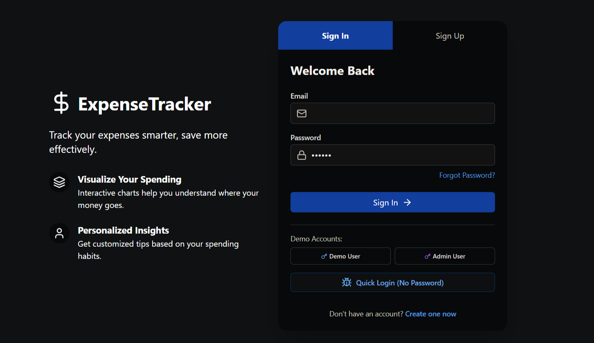
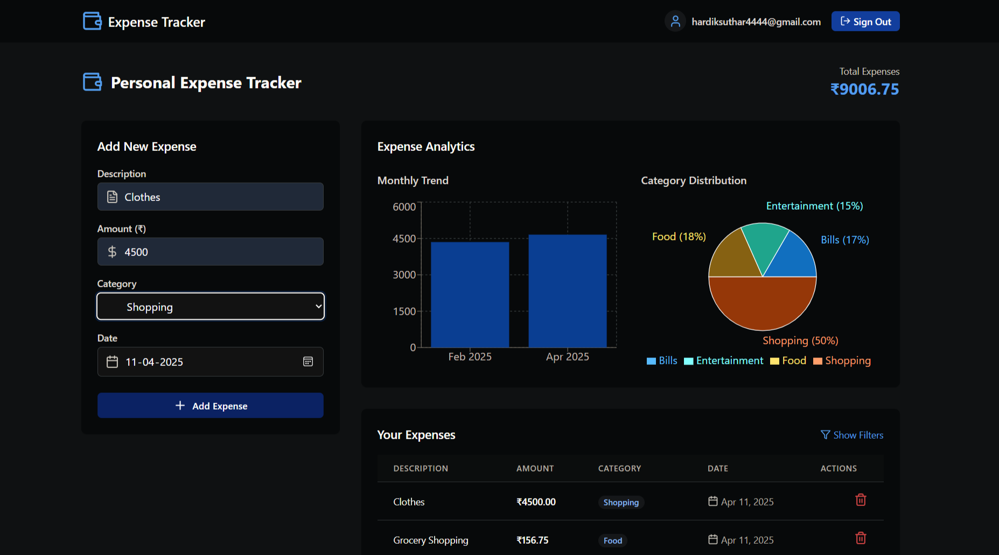

# 💰 ExpenseTracker - Personal Finance Management


## 📊 Overview
ExpenseTracker is a modern, user-friendly application designed to help you manage your personal finances with ease. Track expenses, visualize spending patterns, and gain insights into your financial habits through intuitive charts and detailed analysis.

### ✨ Live Demo
[](https://expense-tracker-kappa-lemon.vercel.app)

## 🚀 Features

✅ **Intuitive Dashboard** - Get a quick overview of your financial status  
✅ **Expense Tracking** - Log expenses with categories, dates, and descriptions  
✅ **Interactive Charts** - Visualize spending by category and track monthly trends  
✅ **Filtering & Search** - Easily find past expenses  
✅ **Responsive Design** - Works seamlessly on desktop and mobile devices  
✅ **Demo Mode** - Try it out with sample data without creating an account  


## 🛠️ Tech Stack

### **Frontend**
- ⚛️ React 18 with TypeScript
- 🎨 Tailwind CSS for styling
- 🎭 Framer Motion for animations
- 🔷 Lucide React for icons
- 🔀 React Router for navigation

### **Data Visualization**
- 📊 Recharts for responsive, composable charts
- 📈 Chart.js with React-Chartjs-2 for advanced visualizations

### **Authentication & Backend**
- 🔐 Supabase for authentication and data storage
- 🧪 Demo mode with local storage for quick testing

### **Build Tools**
- ⚡ Vite for fast development and optimized builds
- 🏗️ TypeScript for type safety
- 🔍 ESLint for code quality

## 📋 Getting Started

### Prerequisites
- 📌 Node.js 16.x or higher
- 📌 npm or yarn

### Installation

1. **Clone the repository**
```bash
  git clone https://github.com/yourusername/expense-tracker.git
  cd expense-tracker
```

2. **Install dependencies**
```bash
  npm install
  # or
  yarn install
```

3. **Start the development server**
```bash
  npm run dev
  # or
  yarn dev
```
## 🖥️ Screenshots

### 🔐 Login Page


### 📊 Dashboard


## 💡 Contributing
We welcome contributions! If you find a bug or have a feature request, please open an issue.

---

🎉 **Enjoy seamless expense tracking with ExpenseTracker!** 🚀

